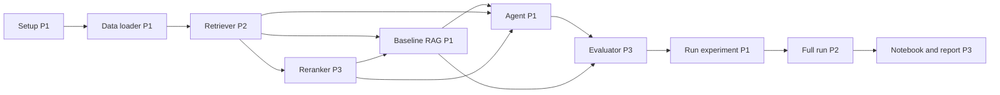

# Three-Person, Three-Week Workload Plan

This schedule aligns with the implementation plan in [`2026-04-08-agentic-multihop-rag.md`](./2026-04-08-agentic-multihop-rag.md). It spreads tasks across three teammates while respecting module dependencies.

---

## Roles (all weeks)

| Person | Primary lane | Rationale |
|--------|----------------|-----------|
| **P1 — Data & integration** | Corpus, loading, wiring pipelines | Downstream code depends on data shape and end-to-end glue. |
| **P2 — Retrieval** | BM25 (and optional dense retrieval later) | Core search path for baseline and agent. |
| **P3 — Ranking & quality** | Cross-encoder, metrics, reporting | Reranking plus evaluation and deliverable figures. |

Rotate merge/integration duty as you prefer; the table below assumes these lanes.

---

## Week 1 — Environment, data, retrieval stack, baseline

**Milestone:** Tasks 1–5 complete; `pytest` passes for data loader, retriever, reranker, and baseline RAG.

| Owner | Tasks | Notes |
|-------|--------|--------|
| **P1** | Task 1 (project structure, `requirements.txt`, `.env.example`), Task 2 (`src/data_loader.py`, `tests/test_data_loader.py`) | Defines sample and corpus structure others rely on. |
| **P2** | Task 3 (`src/retriever.py`, `tests/test_retriever.py`) | Agree early: query in → standardized list of candidate documents (indices or ids + text). |
| **P3** | Task 4 (`src/reranker.py`, `tests/test_reranker.py`) | Inputs must match retriever output contract. |

**End of week (shared):** **Task 5** (`baseline_rag.py` + tests). Recommended owner: **P1**, with **P2/P3** available for API adjustments. Run the full test suite before closing the week.

**Sync points**

- **Start of Week 1 (≈30 min):** Lock interfaces — corpus type, retriever return type, reranker signature.  
- **Mid Week 1:** Confirm `baseline_rag` can import and call retriever + reranker.

---

## Week 2 — Agent loop and evaluation

**Milestone:** Tasks 6–7 complete; agent tests pass (including mocked LLM); evaluator tests pass.

| Owner | Tasks | Notes |
|-------|--------|--------|
| **P1** | Task 6 (`src/agent.py`, `tests/test_agent.py`) | Uses retriever and reranker; keep the LLM JSON response schema stable. |
| **P2** | Support agent integration | Empty results, `top_k` edge cases, retrieval bugs surfaced by the agent loop. |
| **P3** | Task 7 (`src/evaluator.py`, `tests/test_evaluator.py`) | Can implement against result dict shapes from baseline/agent without waiting on live LLM calls. |

**Optional:** If Task 6 is heavy, **P2** can add harnesses or extra agent tests while **P1** implements the core loop.

**Sync point:** After the first successful `AgenticRAG.answer()` path, **P3** confirms evaluator fields match pipeline outputs (`answer`, `retrieved_docs`, `num_hops`, etc.).

---

## Week 3 — Experiments, notebook, report

**Milestone:** Tasks 8–11 complete; `results/experiment_results.json`, executed notebook, final write-up.

| Owner | Tasks | Notes |
|-------|--------|--------|
| **P1** | Task 8 (`src/run_experiment.py`), pilot run (`num_samples=5`) | Owns “full stack runs without crashing.” |
| **P2** | Task 9 — full experiment (50 samples), sanity checks, commit results | Plan estimates ~10–20 minutes; allow margin for API limits and retries. |
| **P3** | Task 10 (`notebooks/analysis.ipynb`), Task 11 report — structure, tables, figures | Numbers from `experiment_results.json`; export plots to `results/`. |

**Report sections (suggested split)**

- **P1:** System design; experimental setup (dataset slice, hyperparameters, hop limits).  
- **P2:** Related work with emphasis on retrieval; discussion of retrieval failure modes.  
- **P3:** Introduction; metric and hop analysis; conclusion.

Everyone should read the full document before submission.

---

## Dependency overview

---

## Risk notes

- **Week 1:** Task 5 (baseline) is the main integration bottleneck — reserve a half-day for joint debugging.  
- **Week 2:** Agent work concentrates on **P1**; **P2** should stay reachable for retrieval fixes.  
- **Week 3:** After `run_experiment` exists, notebook and full run can proceed in parallel.

---

## Replacing P1 / P2 / P3 with names

Edit the tables above to use your names, or add a row here:

| Label | Name |
|-------|------|
| P1 | |
| P2 | | Avaneesh
| P3 | |
